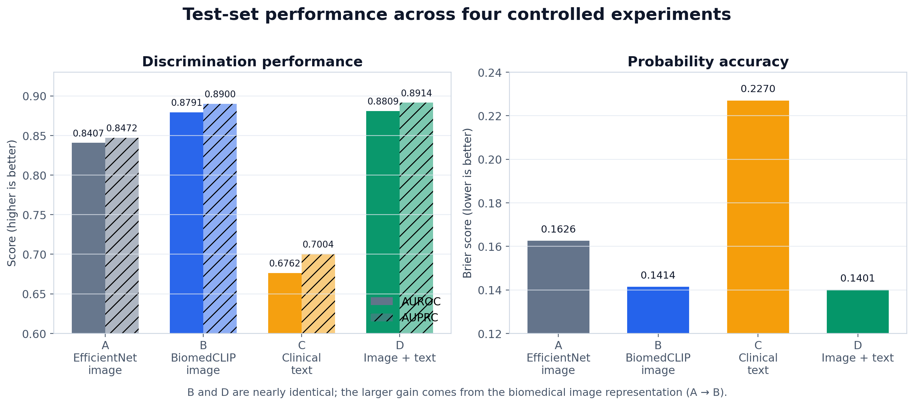
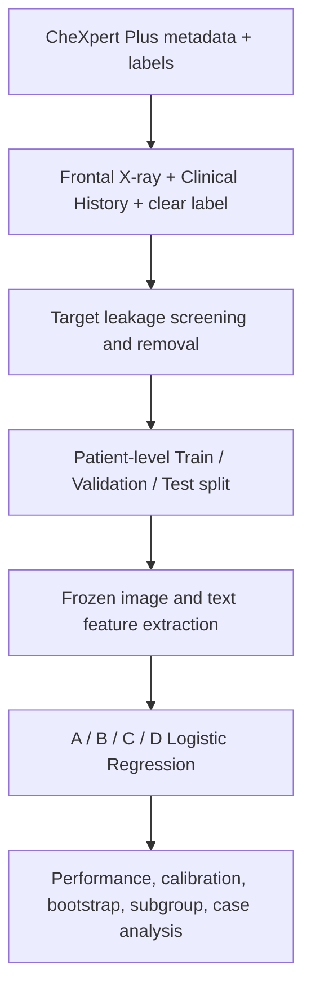
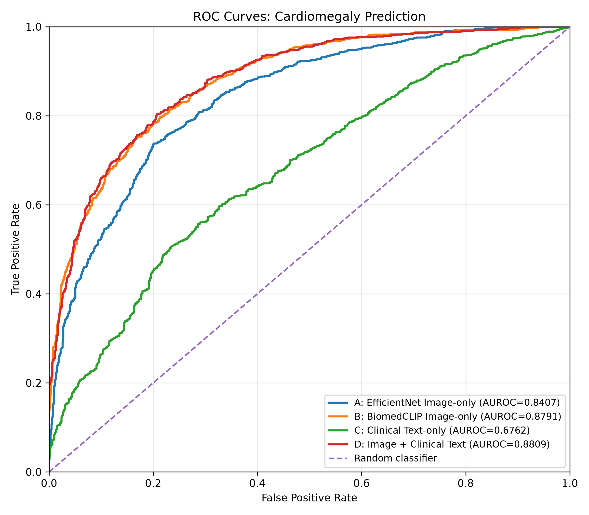
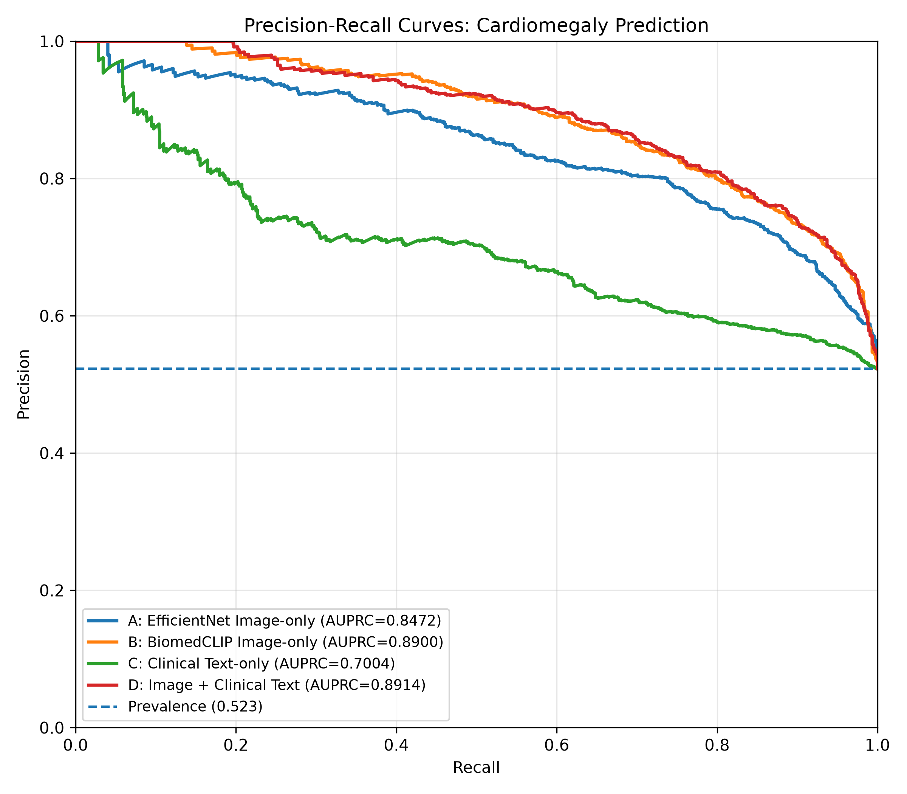
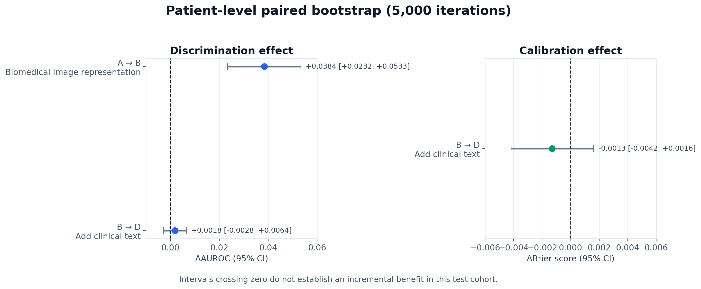
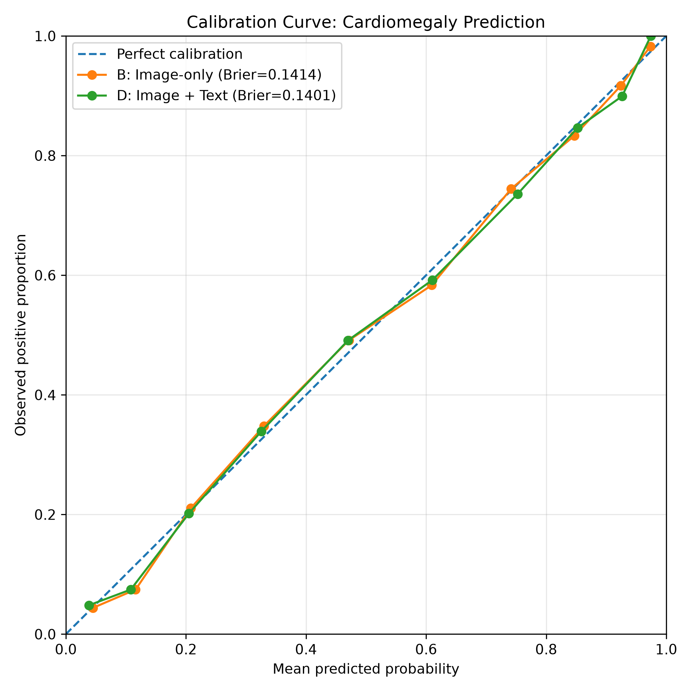
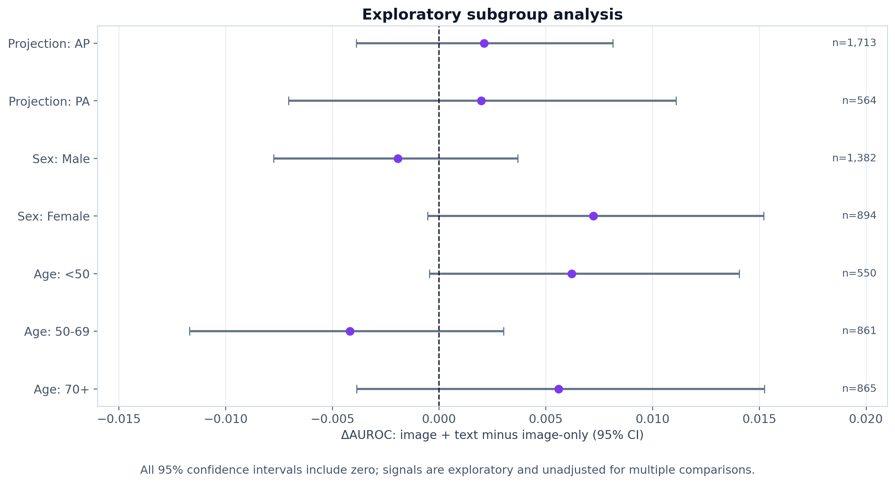
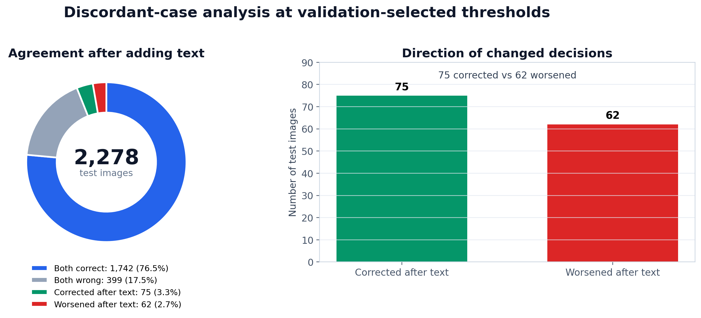

# CXR-Fusion

## Does Clinical Context Add Value to a Biomedical Foundation Model for Cardiomegaly Prediction?

흉부 X-ray에 검사 전 임상정보인 **Clinical History**를 추가하면 심비대(Cardiomegaly) 예측의 성능과 신뢰성이 실제로 향상되는지 검증한 의료 멀티모달 AI 프로젝트입니다.

> **핵심 결론:** BiomedCLIP image-only 모델은 AUROC 0.8791을 보였고, Clinical History를 결합한 모델은 0.8809였습니다. 그러나 환자 단위 paired bootstrap에서 차이의 95% 신뢰구간이 0을 포함했습니다. 이 실험에서는 **강한 image representation을 선택한 효과가 단순히 clinical text를 추가한 효과보다 컸습니다.**

| Project at a glance | 내용 |
|---|---|
| 연구 질문 | Clinical History가 강한 biomedical image model에 추가적인 예측 가치를 제공하는가? |
| Dataset | Stanford CheXpert Plus v1.0 |
| Target | Cardiomegaly binary classification |
| Final cohort | 15,174 images / 10,980 patients |
| Comparison | EfficientNet image / BiomedCLIP image / text / image+text |
| Validation | AUROC, AUPRC, Brier, calibration, patient-level bootstrap, subgroup, discordant cases |
| Main finding | Image representation의 영향은 명확했지만, text의 평균적 incremental benefit은 확인되지 않음 |



---

## 목차

- [1. 프로젝트 배경](#1-프로젝트-배경)
- [2. 연구 질문과 실험 설계](#2-연구-질문과-실험-설계)
- [3. 수행 범위](#3-수행-범위)
- [4. 데이터 구성과 누설 방지](#4-데이터-구성과-누설-방지)
- [5. 모델 구성](#5-모델-구성)
- [6. 평가 설계](#6-평가-설계)
- [7. 결과](#7-결과)
- [8. 개별 사례와 Text contribution 분석](#8-개별-사례와-text-contribution-분석)
- [9. 해석과 한계](#9-해석과-한계)
- [10. 실행 방법](#10-실행-방법)
- [11. 저장소 구조](#11-저장소-구조)
- [12. Data access와 공개 범위](#12-data-access와-공개-범위)

---

## 1. 프로젝트 배경

### 임상정보를 추가하면 항상 더 좋은 모델이 될까?

흉부 X-ray 판독에는 영상뿐 아니라 검사 사유, 증상, 과거력과 같은 임상정보도 함께 활용됩니다. 따라서 영상과 Clinical History를 결합한 멀티모달 모델이 image-only 모델보다 좋아질 것이라는 가설을 세울 수 있습니다.

하지만 임상정보에는 다음과 같은 가능성이 동시에 존재합니다.

- 영상만으로 구분하기 어려운 환자 상태를 보완하는 **유효한 신호**
- 데이터 수집 환경에만 존재하는 **shortcut 또는 spurious association**
- 이미 강한 image encoder가 포착한 정보와 중복되어 **추가 이득이 거의 없는 신호**

그래서 이 프로젝트는 단순히 멀티모달 모델 하나를 만드는 데서 끝내지 않고, 다음을 구분해 확인했습니다.

1. Biomedical domain-specific image representation은 일반 ImageNet representation보다 좋은가?
2. Clinical History 자체에 심비대 예측 신호가 있는가?
3. 그 신호가 강한 image-only 모델 위에서도 **추가 가치(incremental value)**를 가지는가?
4. 평균 성능뿐 아니라 확률 신뢰성, 환자군별 결과, 개별 환자 예측 변화도 안전한가?

---

## 2. 연구 질문과 실험 설계

### 질문을 네 개의 통제된 실험으로 분리

| Experiment | Input / representation | 이 비교가 답하는 질문 |
|---|---|---|
| **A** | X-ray → EfficientNet-B0 (ImageNet) | 일반 자연영상 representation의 기준 성능은 어느 정도인가? |
| **B** | X-ray → BiomedCLIP image encoder | Biomedical image representation이 성능을 개선하는가? (**A vs B**) |
| **C** | Clinical History → BiomedCLIP text encoder | Clinical History 자체에 독립적인 예측 신호가 있는가? |
| **D** | BiomedCLIP image feature + text feature | 강한 image model에 text를 더했을 때 추가 이득이 있는가? (**B vs D**) |

비교의 중심은 단순한 최고 점수 경쟁이 아니라 다음 두 효과를 분리하는 것이었습니다.

- **Representation effect:** `A → B`
- **Clinical-text incremental effect:** `B → D`

### 전체 연구 흐름



모든 pretrained encoder는 **frozen** 상태로 사용했습니다. End-to-end fine-tuning을 하지 않고 feature extraction 뒤 동일 계열의 Logistic Regression을 학습하여, 모델 간 차이를 가능한 한 **입력 modality와 representation의 차이**로 제한했습니다.

---

## 3. 수행 범위

이 프로젝트에서 직접 수행한 작업입니다.

| 단계 | 수행 내용 | 주요 산출물 |
|---|---|---|
| 문제 정의 | “Clinical History가 강한 영상 모델에 추가 가치를 주는가?”로 연구 질문 구체화 | A/B/C/D 비교 설계 |
| 데이터 구조화 | metadata·label·이미지 경로 연결, frontal/label/text 조건 적용 | patient-level manifest |
| 누설 통제 | Findings·Impression 제외, target term 탐지 및 19건 제거 | leakage-controlled cohort |
| 모델링 | EfficientNet 및 BiomedCLIP frozen feature 추출, Logistic Regression 학습 | image/text/fusion models |
| 모델 선택 | 후보 `C={0.01, 0.1, 1, 10}`을 Validation AUROC로 선택 | 고정된 최종 모델 |
| 성능 평가 | AUROC, AUPRC, Brier score, ROC/PR curve | test performance table |
| 통계 검증 | 환자 단위 paired bootstrap 5,000회 | ΔAUROC·ΔBrier 95% CI |
| 신뢰성 점검 | calibration, AP/PA·성별·연령 subgroup | calibration/subgroup results |
| 오류 분석 | validation threshold 고정, discordant case와 logit contribution 분석 | corrected/hurt case analysis |
| 결과 공개 | 원본 의료데이터를 제외한 코드·집계 결과·시각화 정리 | reproducible public repository |

---

## 4. 데이터 구성과 누설 방지

### Dataset

- **Source:** [Stanford AIMI CheXpert Plus v1.0](https://stanfordaimi.azurewebsites.net/datasets/5158c524-d3ab-4e02-96e9-6ee9efc110a1)
- **Original metadata:** 223,462 X-ray images
- **Target:** `Cardiomegaly`
- **Image:** frontal chest X-ray
- **Text:** `section_clinical_history` + `section_history`

### Cohort inclusion

다음 조건을 모두 만족한 데이터만 사용했습니다.

1. `frontal_lateral == frontal`
2. Clinical History가 비어 있지 않음
3. Cardiomegaly label이 명확한 `0` 또는 `1`
4. Clinical History에 target을 직접 노출하는 표현이 없음

### Target leakage control

`Findings`와 `Impression`은 영상을 판독한 뒤 작성된 정보이므로 입력에 포함하면 정답이 직접 노출될 수 있습니다. 따라서 두 영역은 전면 제외하고, 검사 전 정보에 해당하는 Clinical History 계열만 사용했습니다.

Clinical History 안에서도 다음과 같은 target 표현을 정규식으로 검사했습니다.

```text
cardiomegaly, cardiomegalic, cardiac enlargement, enlarged heart,
heart enlargement, enlarged cardiac silhouette,
cardiac silhouette enlargement, enlarged cardiomediastinal silhouette
```

해당 표현이 포함된 **19건을 제거**했습니다.

### Patient-level split

한 환자에게 여러 장의 X-ray가 존재할 수 있으므로 이미지 단위로 무작위 분할하면 동일 환자의 영상이 Train과 Test에 동시에 들어가는 leakage가 발생할 수 있습니다. 이를 방지하기 위해 `deid_patient_id`를 group으로 사용했습니다.

| Split | Images | Patients | 용도 |
|---|---:|---:|---|
| Train | 10,669 | 7,685 | Logistic Regression 학습 |
| Validation | 2,227 | 1,647 | Hyperparameter 및 threshold 선택 |
| Test | 2,278 | 1,648 | 최종 성능 평가에만 사용 |
| **Total** | **15,174** | **10,980** | Positive 8,049 / Negative 7,125 |

- Train ∩ Validation patients = **0**
- Train ∩ Test patients = **0**
- Validation ∩ Test patients = **0**
- Test prevalence = **0.523**

### Test set 보호 원칙

- Logistic Regression의 `C`는 Validation AUROC만으로 선택했습니다.
- Discordant analysis의 분류 threshold도 Validation set에서 Youden's J로 선택했습니다.
- 선택된 모델과 threshold를 Test set에 고정 적용했습니다.
- Test 결과를 보고 hyperparameter나 threshold를 다시 조정하지 않았습니다.

---

## 5. 모델 구성

| Model | Encoder | Feature | Classifier |
|---|---|---:|---|
| **A. EfficientNet image-only** | EfficientNet-B0, ImageNet pretrained | 1,280-d | Logistic Regression |
| **B. BiomedCLIP image-only** | BiomedCLIP ViT image encoder | 512-d | Logistic Regression |
| **C. Clinical text-only** | BiomedCLIP PubMedBERT text encoder | 512-d | Logistic Regression |
| **D. Image + Clinical text** | B image feature ⊕ C text feature | 1,024-d | Logistic Regression |

사용한 foundation model은 [`microsoft/BiomedCLIP-PubMedBERT_256-vit_base_patch16_224`](https://huggingface.co/microsoft/BiomedCLIP-PubMedBERT_256-vit_base_patch16_224)입니다.

### Feature extraction

- Image와 text feature는 각각 L2 normalization을 적용했습니다.
- Image와 text feature의 `path_to_image`, label, split 순서가 완전히 같은지 assertion으로 검증했습니다.
- D 모델은 두 512차원 feature를 단순 concatenation한 **late fusion**입니다.
- 복잡한 fusion 구조를 사용하지 않아 “단순 text 추가”의 효과를 해석하기 쉽게 유지했습니다.

### Model selection

모든 A/B/C/D 분류기는 동일하게 다음 후보를 비교했습니다.

```text
C candidates: 0.01, 0.1, 1.0, 10.0
Selection rule: highest Validation AUROC
```

최종 Test set은 선택된 모델을 한 번 평가하는 용도로만 사용했습니다.

---

## 6. 평가 설계

| 평가 축 | 지표 / 분석 | 확인하려는 내용 |
|---|---|---|
| Discrimination | AUROC | 양성과 음성의 전반적인 순위 구분 능력 |
| Positive-class performance | AUPRC | 양성 예측의 precision-recall 균형 |
| Probability accuracy | Brier score | 예측 확률과 실제 결과 사이의 오차 |
| Calibration | 10-bin quantile calibration curve | 예측한 위험도와 실제 양성률의 일치 정도 |
| Statistical uncertainty | Patient-level paired bootstrap 5,000회 | 모델 차이의 95% 신뢰구간 |
| Robustness | AP/PA, sex, age subgroup | 특정 환자군에서만 효과가 나타나는지 탐색 |
| Failure analysis | Discordant cases | Text 추가가 어떤 환자에서 예측을 고치거나 망치는지 |
| Modality contribution | Logit decomposition | D 내부에서 image와 text가 어느 방향으로 작용했는지 |

여러 영상이 같은 환자에게 속할 수 있으므로 bootstrap도 이미지가 아니라 **환자를 복원추출한 뒤 그 환자의 모든 영상을 포함**하는 방식으로 수행했습니다.

---

## 7. 결과

### 7.1 전체 성능

| Model | Test AUROC | Test AUPRC | Brier ↓ |
|---|---:|---:|---:|
| **A.** EfficientNet-B0 image-only | 0.8407 | 0.8472 | 0.1626 |
| **B.** BiomedCLIP image-only | 0.8791 | 0.8900 | 0.1414 |
| **C.** Clinical text-only | 0.6762 | 0.7004 | 0.2270 |
| **D.** Image + Clinical text | **0.8809** | **0.8914** | **0.1401** |

#### 관찰된 패턴

1. **A → B:** AUROC가 0.8407에서 0.8791로 증가했습니다.
2. **C:** Text-only AUROC 0.6762로 Clinical History 자체에는 예측 신호가 있었습니다.
3. **B → D:** AUROC는 0.8791에서 0.8809로 0.0018 증가하는 데 그쳤습니다.
4. AUROC와 AUPRC가 모두 **B ≈ D > A > C** 순서를 보여, 지표에 따라 결론이 뒤바뀌지 않았습니다.

### 7.2 ROC / Precision–Recall curves

<table>
<tr>
<td width="50%"></td>
<td width="50%"></td>
</tr>
<tr>
<td><b>ROC.</b> B는 A보다 위에 위치하지만 B와 D 곡선은 거의 겹칩니다.</td>
<td><b>PR.</b> 점선은 test prevalence 0.523에 해당하는 baseline입니다.</td>
</tr>
</table>

### 7.3 Patient-level paired bootstrap

점수의 작은 차이가 우연한 표본 변동인지 확인하기 위해 환자 단위 paired bootstrap을 5,000회 수행했습니다.



| 비교 | 지표 | 추정값 | 95% CI | 해석 |
|---|---|---:|---|---|
| A vs B | ΔAUROC | **+0.0384** | +0.0232 ~ +0.0533 | CI 전체가 0보다 큼 |
| B vs D | ΔAUROC | **+0.0018** | −0.0028 ~ +0.0064 | CI가 0을 포함 |
| B vs D | ΔBrier | −0.0013 | −0.0042 ~ +0.0016 | CI가 0을 포함 |

따라서 이 test cohort에서는 다음과 같이 해석했습니다.

- **Biomedical image representation의 효과(A → B)는 명확했습니다.**
- **Clinical text의 incremental effect(B → D)는 통계적으로 확인되지 않았습니다.**
- Brier score도 D가 수치상 조금 낮았지만, 차이가 0일 가능성을 배제할 수 없었습니다.

### 7.4 Calibration

임상에서 모델 출력은 단순 양성/음성보다 위험 확률로 활용될 수 있으므로, discrimination뿐 아니라 calibration도 확인했습니다.

<p align="center">
  
</p>

B와 D 모두 대각선에 비교적 가까웠고 두 곡선도 유사했습니다. D의 Brier score가 0.1401로 B의 0.1414보다 낮았지만, ΔBrier의 bootstrap 95% CI가 0을 포함하여 **text가 probability calibration을 명확히 개선했다고 판단하지 않았습니다.**

### 7.5 Exploratory subgroup analysis

Clinical text가 특정 촬영 방식이나 환자군에서만 도움이 되는지 탐색했습니다.



| Subgroup | n | B Image | D Image+Text | ΔAUROC | 95% CI |
|---|---:|---:|---:|---:|---|
| AP | 1,713 | 0.8642 | 0.8663 | +0.0021 | −0.0039 ~ +0.0081 |
| PA | 564 | 0.8954 | 0.8974 | +0.0020 | −0.0070 ~ +0.0111 |
| Male | 1,382 | 0.9009 | 0.8990 | −0.0019 | −0.0077 ~ +0.0037 |
| Female | 894 | 0.8427 | 0.8499 | +0.0072 | −0.0005 ~ +0.0152 |
| Age <50 | 550 | 0.9350 | 0.9413 | +0.0062 | −0.0005 ~ +0.0141 |
| Age 50–69 | 861 | 0.8710 | 0.8669 | −0.0042 | −0.0117 ~ +0.0030 |
| Age 70+ | 865 | 0.8339 | 0.8395 | +0.0056 | −0.0039 ~ +0.0152 |

모든 subgroup의 신뢰구간이 0을 포함했습니다. Female과 Age <50에서 상대적으로 큰 증가 경향이 있었지만, 이 분석은 사전에 검정력을 확보하도록 설계되지 않았고 다중비교 보정도 하지 않았으므로 **가설 생성용 exploratory signal**로만 해석했습니다.

AP 영상은 portable·bedside 촬영에서 흔하며 심장이 확대되어 보일 수 있어 별도로 확인했습니다. Image-only 성능은 AP가 PA보다 낮았지만, Clinical History가 AP에서 특별히 더 큰 추가 이득을 주지는 않았습니다.

---

## 8. 개별 사례와 Text contribution 분석

### 8.1 왜 discordant case를 확인했는가?

평균 ΔAUROC가 +0.0018이라는 결과에는 두 가지 가능성이 있습니다.

1. Text가 거의 모든 환자에게 아무 영향도 주지 않았다.
2. 일부 환자에서는 도움을 주고 다른 환자에서는 해를 주어 평균에서 상쇄되었다.

두 경우는 임상적 의미가 다르므로 Validation set에서 Youden's J로 threshold를 선택한 뒤 Test set에 고정 적용했습니다.

- B image-only threshold: **0.5197**
- D image+text threshold: **0.5164**



| Case type | n | 의미 |
|---|---:|---|
| Both correct | 1,742 | 두 모델 모두 정답 |
| Both wrong | 399 | 두 모델 모두 오답 |
| **Corrected after text** | **75** | B는 오답, D는 정답 |
| **Worsened after text** | **62** | B는 정답, D는 오답 |

Text 추가 후 75건이 교정되고 62건이 악화되었습니다. 일부 사례에서는 예측 확률이 0.4 이상 크게 이동했습니다. 즉, **cohort-level 평균 향상은 작았지만 개별 환자 수준에서는 text가 예측을 실질적으로 바꿨습니다.**

### 8.2 Multimodal logit decomposition

D 모델은 Logistic Regression이므로 최종 logit을 modality별로 분리할 수 있습니다.

```text
D logit = intercept
        + image_feature · image_weight
        + text_feature  · text_weight
```

`analyze_text_contribution.py`에서 위 식으로 직접 계산한 확률이 `model.predict_proba()`와 일치하는지 `np.allclose(..., atol=1e-6)`로 검증했습니다.

이 분석으로 대표 discordant case에서 image와 text가 각각 positive 또는 negative 방향으로 얼마나 작용했는지 확인했습니다.

- 심부전 과거력이 positive 방향으로 작용했지만 실제 음성인 사례에서는 false-positive가 발생했습니다.
- 심비대와 직접적인 관련성이 뚜렷하지 않은 신경계 응급상황 관련 검사 사유가 큰 positive contribution을 보인 사례가 있었습니다.

후자는 text encoder가 dataset-specific shortcut 또는 spurious association을 사용할 가능성을 보여줍니다. 다만 이는 **가능성을 제시하는 정성적 관찰**이며, 특정 문구가 결과의 원인이라고 증명한 것은 아닙니다.

> Text contribution은 문장 전체 embedding과 Logistic Regression weight의 내적입니다. 개별 단어의 인과적 중요도나 attention score로 해석할 수 없습니다.

> 대표 사례 패널에는 실제 CheXpert Plus X-ray와 Clinical History가 포함되므로 data use agreement에 따라 공개 저장소에는 올리지 않았습니다.

---

## 9. 해석과 한계

### 최종 해석

#### 1) Domain-specific image representation의 영향은 컸다

EfficientNet-B0에서 BiomedCLIP image encoder로 변경했을 때 ΔAUROC는 +0.0384였고 95% CI 전체가 0보다 컸습니다. 같은 이미지라도 어떤 representation을 사용하는지가 결과에 큰 영향을 주었습니다.

#### 2) Clinical History에는 신호가 있었지만 추가 이득은 작았다

Text-only AUROC가 0.6762였으므로 Clinical History가 무작위 정보는 아니었습니다. 그러나 강한 BiomedCLIP image feature와 결합했을 때 평균 AUROC와 calibration의 명확한 개선은 확인되지 않았습니다.

#### 3) 평균 지표만으로는 안전성을 판단할 수 없다

75건의 교정과 62건의 악화가 동시에 발생했습니다. 멀티모달 모델은 평균 점수가 비슷하더라도 개별 환자에서 결정을 크게 바꿀 수 있으므로 case-level 검토가 필요합니다.

### 결과의 의미

Clinical History 단독 모델은 무작위보다 높은 예측력을 보였지만, 영상 정보에 Clinical History를 추가했을 때는 성능과 확률 신뢰성이 뚜렷하게 향상되지 않았습니다.

이는 Clinical History가 불필요하다는 의미가 아닙니다. CheXpert Plus의 심비대 예측에서 BiomedCLIP 특징을 고정해 사용하고 영상과 텍스트 특징을 단순 결합한 이번 실험에서는, Clinical History의 추가적인 효과를 확인하지 못했다는 의미입니다.

### Limitations

1. Cardiomegaly 단일 target만 분석했습니다.
2. CheXpert Plus 단일 dataset 내부 평가이며 external validation이 없습니다.
3. Cardiomegaly label은 report-derived reference label이며 별도 영상 재판독을 거치지 않았습니다.
4. Frozen encoder + Logistic Regression 설정으로, end-to-end fine-tuning 결과와 다를 수 있습니다.
5. Fusion은 단순 feature concatenation이며 cross-attention 등 학습형 fusion을 사용하지 않았습니다.
6. AP/PA, sex, age subgroup 분석은 exploratory이며 다중비교 보정을 적용하지 않았습니다.
7. Text logit contribution은 문장 embedding 수준의 연관성으로, 단어 수준 인과 효과가 아닙니다.
8. 임상정보의 품질과 표현 방식이 다른 외부 기관에서도 같은 결과가 재현되는지는 확인하지 못했습니다.

### Future work

- MIMIC-CXR 등 외부 dataset validation
- Learned multimodal fusion 또는 cross-attention 비교
- Pneumonia, Edema 등 다른 chest finding으로 확장
- 특정 clinical phrase ablation: CHF 관련 표현 제거 전후 비교
- Dataset shortcut / spurious correlation의 정량 분석
- Text가 도움·악화를 유발하는 환자 특성의 사전 정의 및 독립 검증

---

## 10. 실행 방법

### Environment

- Python 3.12
- pandas / NumPy / scikit-learn
- PyTorch / torchvision / OpenCLIP
- Matplotlib / joblib
- Redivis Python client

현재 feature extraction 코드는 Intel XPU가 사용 가능하면 XPU를 선택하고, 그렇지 않으면 CPU를 사용합니다.

### Installation

```bash
git clone https://github.com/sojeong8282/cxr-fusion.git
cd cxr-fusion
pip install -r requirements.txt
```

### Pipeline

```bash
# 0) 데이터 준비
python main.py                          # metadata + label 병합, cohort, patient split
python download_images.py               # CheXpert Plus 이미지 다운로드
python check_images.py                  # 파일 수 및 유효 이미지 검증

# 1) Frozen feature extraction
python extract_image_features.py        # BiomedCLIP image → 512-d
python extract_text_features.py         # BiomedCLIP text → 512-d
python extract_efficientnet_features.py # EfficientNet-B0 image → 1280-d

# 2) A / B / C / D classifier
python train_efficientnet_classifier.py
python train_biomedclip_classifier.py
python train_text_classifier.py
python train_multimodal_classifier.py

# 3) Statistical validation
python bootstrap_a_vs_b.py
python bootstrap_b_vs_d.py
python calibration_b_vs_d.py
python subgroup_ap_pa.py
python subgroup_sex_age.py

# 4) Failure analysis
python discordant_case_analysis.py
python analyze_text_contribution.py
python plot_case_analysis.py
python plot_abcd_curves.py

# 5) README figures from public aggregate results
python generate_readme_figures.py
```

### 결과 파일

`results/`에는 재배포 가능한 **집계 결과만** 포함했습니다.

| File | Description |
|---|---|
| `main_results.csv` | A/B/C/D Test AUROC, AUPRC, Brier |
| `bootstrap_summary.csv` | A vs B, B vs D의 ΔAUROC·ΔBrier와 95% CI |
| `discordant_summary.csv` | Both correct/wrong, corrected/hurt case count |
| `subgroup_ap_pa_results.csv` | AP/PA subgroup result |
| `subgroup_sex_age_results.csv` | Sex/Age subgroup result |
| `roc_abcd.png`, `pr_abcd.png` | ROC / Precision–Recall curves |
| `calibration_b_vs_d.png` | B vs D calibration curve |
| `model_performance_overview.png` | README용 전체 성능 비교 |
| `bootstrap_effects.png` | README용 bootstrap effect plot |
| `subgroup_delta_auroc.png` | README용 subgroup forest plot |
| `discordant_cases_overview.png` | README용 discordant case summary |

---

## 11. 저장소 구조

```text
cxr-fusion/
├── main.py                              # Cohort construction and split
├── download_images.py                   # Redivis image download
├── check_images.py                      # Image integrity check
│
├── extract_efficientnet_features.py     # A feature extraction
├── extract_image_features.py            # B/D image feature extraction
├── extract_text_features.py             # C/D text feature extraction
│
├── train_efficientnet_classifier.py     # A: ImageNet image-only
├── train_biomedclip_classifier.py       # B: BiomedCLIP image-only
├── train_text_classifier.py             # C: Clinical text-only
├── train_multimodal_classifier.py       # D: Image + text late fusion
│
├── bootstrap_a_vs_b.py                  # Representation effect
├── bootstrap_b_vs_d.py                  # Incremental text effect
├── calibration_b_vs_d.py                # Calibration and ΔBrier
├── subgroup_ap_pa.py                    # Projection subgroup
├── subgroup_sex_age.py                  # Demographic subgroup
│
├── discordant_case_analysis.py          # Corrected / worsened cases
├── analyze_text_contribution.py         # Modality logit contribution
├── plot_case_analysis.py                # Private case panel generator
├── plot_abcd_curves.py                  # ROC / PR curves
├── generate_readme_figures.py           # Public aggregate figures
│
├── results/                              # Redistributable summaries
├── requirements.txt
└── README.md
```

---

## 12. Data access와 공개 범위

이 저장소에는 다음 자료가 포함되어 있지 않습니다.

- CheXpert Plus 원본 metadata와 labels
- 파생 patient-level manifest
- Clinical History 원문
- X-ray 이미지
- 환자별 prediction과 discordant case 상세자료
- 학습된 model 또는 feature 파일

CheXpert Plus는 Stanford AIMI의 data use agreement에 따라 배포됩니다. 재현하려면 [CheXpert Plus 공식 페이지](https://stanfordaimi.azurewebsites.net/datasets/5158c524-d3ab-4e02-96e9-6ee9efc110a1)에서 직접 접근 권한을 받은 뒤 필요한 파일을 `data/`에 배치해야 합니다.

README의 그래프는 원본 의료데이터가 아니라 `results/*.csv`의 집계 수치로 생성했습니다.

---

## References

- [CheXpert Plus — Stanford AIMI Shared Datasets](https://stanfordaimi.azurewebsites.net/datasets/5158c524-d3ab-4e02-96e9-6ee9efc110a1)
- [BiomedCLIP model card — Microsoft / Hugging Face](https://huggingface.co/microsoft/BiomedCLIP-PubMedBERT_256-vit_base_patch16_224)
- [BiomedCLIP: a multimodal biomedical foundation model pretrained from fifteen million scientific image-text pairs](https://arxiv.org/abs/2303.00915)

## Disclaimer

연구·교육 및 포트폴리오 목적으로 수행한 프로젝트입니다. 실제 임상 진단이나 환자 치료 의사결정에 사용할 수 없습니다.
